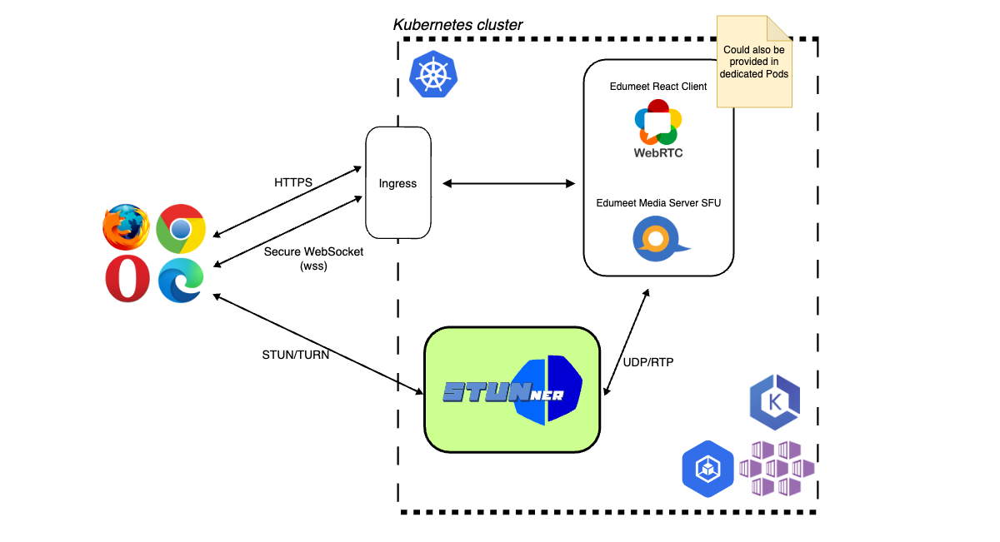

# SenseCareMeet K8s Deployment

## Prerequisites 

K8s Cluster with

* the ability to provision a dedicated internet-facing Network Load Balancer (L4) for incoming UDP connections
* STUNner to allow the operation of a WebRTC architecture including STUN/TURN service within Kubernetes (see also [WebRTC Architecture](#webrtc-architecture))
* cert-manager to automate certificate creation and renewal
* external-dns to automate the creation of DNS records for ingress resources
* ImagePullSecret to pull the SenceCareMeet image from ghcr.io

## How to deploy

There is a `deploy.sh` script in this directory. It takes into account the correct deployment order of the different components and creates the STUNner credentials from environment variables.

## WebRTC Architecture

Due to the fact that Kubernetes networking relies on multiple NAT steps (which masks the original client IP header) and WebRTC uses stateless UDP without session context (as with TCP), the only way to identify the clients is to disable K8s networking for the WebRTC media server Pods by deploying them into the hosts network namespace. This is a well-documented K8s anti-pattern. At this point STUNner comes into play:

It provides a STUN/TURN service and controls the way how WebRTC media traffic is routed to the media server Pods running in the cluster. For a architectural overview have a look at the image below, for details see https://docs.l7mp.io/en/latest/CONCEPTS/. 

